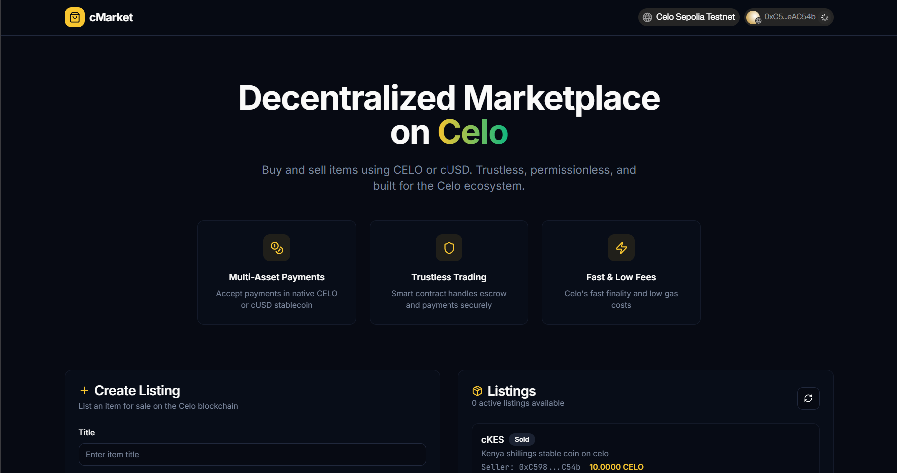
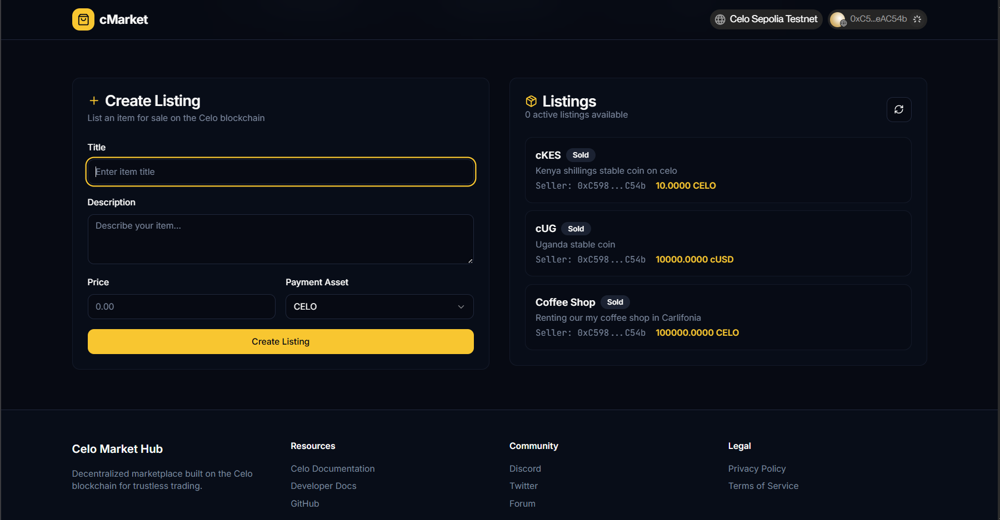

# Celo Market Hub

[](https://celo.org)
[](https://reactjs.org)
[](https://www.typescriptlang.org)
[](https://vitejs.dev)

A decentralized marketplace built on the Celo blockchain, enabling trustless peer-to-peer trading with native support for CELO and cUSD tokens.



## 🌟 Features

- **Decentralized Trading**: Smart contract-based escrow system for secure transactions
- **Multi-Asset Support**: Accept payments in CELO and cUSD stablecoin
- **Fast & Low Fees**: Leverage Celo's fast finality and minimal gas costs
- **Trustless Architecture**: No intermediaries, fully decentralized
- **Modern UI**: Built with React, TypeScript, and Tailwind CSS
- **Wallet Integration**: Seamless connection with MetaMask, Coinbase Wallet, and more
- **Network Support**: Deployed on Celo Mainnet and Sepolia Testnet

## 🚀 Live Demo

- **Mainnet**: [cmarket-seven.vercel.app](https://cmarket-seven.vercel.app)
- **Testnet**: [testnet.celo-market-hub.vercel.app](https://testnet.celo-market-hub.vercel.app)

## 🏗️ System Architecture

```
┌─────────────────────────────────────────────────────────────────┐
│                    Celo Market Hub Architecture                  │
└─────────────────────────────────────────────────────────────────┘
                                    │
                                    ▼
┌─────────────────────────────────────────────────────────────────┐
│                        User Interface                            │
│  ┌─────────────────┐  ┌─────────────────┐  ┌─────────────────┐  │
│  │   React App     │  │   Reown AppKit  │  │   Tailwind CSS  │  │
│  │   (Vite + TS)   │  │   Wallet Connect│  │   + shadcn/ui   │  │
│  └─────────────────┘  └─────────────────┘  └─────────────────┘  │
└─────────────────────────────────────────────────────────────────┘
                                    │
                                    ▼
┌─────────────────────────────────────────────────────────────────┐
│                    Web3 Integration Layer                       │
│  ┌─────────────────┐  ┌─────────────────┐  ┌─────────────────┐  │
│  │     Wagmi       │  │      Viem       │  │   TanStack      │  │
│  │   (React Hooks) │  │   (Ethereum Lib)│  │     Query       │  │
│  └─────────────────┘  └─────────────────┘  └─────────────────┘  │
└─────────────────────────────────────────────────────────────────┘
                                    │
                                    ▼
┌─────────────────────────────────────────────────────────────────┐
│                      Blockchain Layer                            │
│  ┌─────────────────┐                    ┌─────────────────┐     │
│  │   Celo Network  │◄──────────────────►│ Smart Contracts  │     │
│  │ (Mainnet/Testnet│                    │  (Solidity)      │     │
│  │     Sepolia)    │                    │                   │     │
│  └─────────────────┘                    └─────────────────┘     │
│          ▲                           ▲                          │
│          │                           │                          │
│          └─────────────┬─────────────┘                          │
│                        ▼                                        │
│  ┌─────────────────┐  ┌─────────────────┐  ┌─────────────────┐  │
│  │   CELO Token    │  │   cUSD Stable  │  │   Gas Fees       │  │
│  │   (Native)      │  │   Coin (ERC20)  │  │   (Minimal)     │  │
│  └─────────────────┘  └─────────────────┘  └─────────────────┘  │
└─────────────────────────────────────────────────────────────────┘
                                    │
                                    ▼
┌─────────────────────────────────────────────────────────────────┐
│                      Data Flow & Security                        │
│  ┌─────────────────┐  ┌─────────────────┐  ┌─────────────────┐  │
│  │   Decentralized │  │   Escrow System │  │   Trustless      │  │
│  │   Marketplace   │  │   (Smart Contract│  │   Transactions  │  │
│  │   (P2P Trading) │  │       Based)     │  │                 │  │
│  └─────────────────┘  └─────────────────┘  └─────────────────┘  │
└─────────────────────────────────────────────────────────────────┘
                                    │
                                    ▼
┌─────────────────────────────────────────────────────────────────┐
│                        User Roles                               │
│  ┌─────────────────┐                    ┌─────────────────┐     │
│  │     Buyers      │◄──────────────────►│    Sellers       │     │
│  │ • Browse Listings│                    │ • Create Listings│     │
│  │ • Purchase Items │                    │ • Set Prices     │     │
│  │ • Confirm Receipt│                    │ • Receive Payments│     │
│  └─────────────────┘                    └─────────────────┘     │
└─────────────────────────────────────────────────────────────────┘
```

### Architecture Overview

1. **Frontend Layer**: Modern React application with TypeScript, built with Vite for optimal performance
2. **Wallet Integration**: Reown AppKit provides seamless connection to Web3 wallets (MetaMask, Coinbase, etc.)
3. **Web3 Layer**: Wagmi and Viem handle blockchain interactions and smart contract calls
4. **Blockchain Layer**: Deployed on Celo network with custom marketplace smart contracts
5. **Token Support**: Native CELO and cUSD stablecoin for payments and gas fees
6. **Security Model**: Decentralized escrow system ensures trustless transactions between buyers and sellers

### Key Components

- **Smart Contracts**: Handle escrow, listings, and payments
- **Escrow System**: Funds are locked until delivery confirmation
- **Multi-Network**: Support for both production (Mainnet) and testing (Sepolia)
- **Gas Optimization**: Celo's low fees enable micro-transactions
- **Responsive UI**: Mobile-first design with modern UX patterns



## 📋 Prerequisites

Before running this project, ensure you have:

- **Node.js**: Version 18.0.0 or higher
- **npm**: Version 8.0.0 or higher (or pnpm/yarn)
- **Git**: For cloning the repository
- **Wallet**: MetaMask, Coinbase Wallet, or any Web3 wallet

## 🔧 Installation

1. **Clone the repository**
   ```bash
   git clone https://github.com/your-username/celo-market-hub.git
   cd celo-market-hub
   ```

2. **Install dependencies**
   ```bash
   npm install
   # or
   pnpm install
   ```

3. **Environment Setup**
   Create a `.env` file in the root directory:
   ```env
   VITE_WALLETCONNECT_PROJECT_ID=your_walletconnect_project_id_here
   ```

   > **Note**: Get your WalletConnect Project ID from [Reown Dashboard](https://dashboard.reown.com)

4. **Start the development server**
   ```bash
   npm run dev
   # or
   pnpm dev
   ```

5. **Open your browser**
   Navigate to `http://localhost:8080`

## ⚙️ Configuration

### WalletConnect Setup

1. Visit [Reown Dashboard](https://dashboard.reown.com)
2. Create a new project
3. Copy your Project ID
4. Replace `your_walletconnect_project_id_here` in `.env`

### Network Configuration

The app supports both Celo Mainnet and Sepolia Testnet:

- **Mainnet**: Production environment
- **Sepolia**: Testing environment with test tokens

Switch networks using the network selector in the app header.

## 📖 Usage

### For Buyers
1. Connect your Web3 wallet
2. Browse available listings
3. Select an item and complete purchase
4. Funds are held in escrow until delivery confirmation

### For Sellers
1. Connect your Web3 wallet
2. Create a new listing with item details
3. Set price in CELO or cUSD
4. Receive payments automatically when buyers confirm delivery

### Smart Contract Interaction
- All transactions are handled by audited smart contracts
- Escrow system ensures both parties fulfill obligations
- Gas fees are minimal on Celo network

## 🏗️ Project Structure

```
celo-market-hub/
├── public/                 # Static assets
├── src/
│   ├── components/         # Reusable UI components
│   │   ├── ui/            # shadcn/ui components
│   │   ├── CreateListingForm.tsx
│   │   ├── Hero.tsx
│   │   ├── ListingsTable.tsx
│   │   └── Navbar.tsx
│   ├── hooks/             # Custom React hooks
│   │   ├── useCeloChain.ts
│   │   └── useCMarket.ts
│   ├── lib/               # Utilities and configurations
│   │   ├── constants.ts   # Contract addresses
│   │   ├── wagmiConfig.ts # Web3 configuration
│   │   └── utils.ts       # Helper functions
│   ├── pages/             # Route components
│   │   ├── Index.tsx
│   │   └── NotFound.tsx
│   ├── App.tsx            # Main app component
│   └── main.tsx           # App entry point
├── package.json
├── vite.config.ts
├── tailwind.config.ts
└── README.md
```

## 🚀 Deployment

### Vercel (Recommended)

1. **Connect Repository**
   - Import your GitHub repository to Vercel
   - Vercel will automatically detect Vite configuration

2. **Environment Variables**
   - Add `VITE_WALLETCONNECT_PROJECT_ID` in Vercel dashboard

3. **Deploy**
   - Push to main branch or deploy manually
   - App will be live at `cmarket-seven.vercel.app`

### Other Platforms

The app can be deployed to any static hosting service:

- **Netlify**: Drag & drop the `dist` folder
- **GitHub Pages**: Use GitHub Actions for automated deployment
- **AWS S3 + CloudFront**: For enterprise deployments

Build the app:
```bash
npm run build
```

## 🤝 Contributing

We welcome contributions from the community! Here's how you can help:

### Development Setup

1. Fork the repository
2. Create a feature branch: `git checkout -b feature/amazing-feature`
3. Install dependencies: `npm install`
4. Make your changes
5. Run tests: `npm run lint`
6. Commit changes: `git commit -m 'Add amazing feature'`
7. Push to branch: `git push origin feature/amazing-feature`
8. Open a Pull Request

### Guidelines

- **Code Style**: Follow TypeScript and ESLint rules
- **Commits**: Use conventional commit format
- **Testing**: Test on both Mainnet and Testnet
- **Documentation**: Update README for new features
- **Security**: Never commit private keys or sensitive data

### Areas for Contribution

- **Smart Contracts**: Audit and optimize contract code
- **UI/UX**: Improve user interface and experience
- **Testing**: Add comprehensive test coverage
- **Documentation**: Expand developer and user guides
- **Localization**: Add support for multiple languages

## 📄 License

This project is licensed under the MIT License - see the [LICENSE](LICENSE) file for details.

## 🙏 Acknowledgments

- **Celo Foundation**: For providing the fast and carbon-negative blockchain
- **Reown**: For the excellent AppKit wallet connection library
- **shadcn**: For the beautiful UI component library
- **Vercel**: For hosting and deployment platform

## 📞 Support

- **Issues**: [GitHub Issues](https://github.com/your-username/celo-market-hub/issues)
- **Discussions**: [GitHub Discussions](https://github.com/your-username/celo-market-hub/discussions)
- **Discord**: Join our community on [Discord](https://discord.gg/celo)
- **Forum**: [Celo Forum](https://forum.celo.org)

## 🔒 Security

This project implements several security measures:

- **Smart Contract Audits**: All contracts are audited by professional security firms
- **Input Validation**: Comprehensive client and server-side validation
- **Rate Limiting**: Protection against abuse and spam
- **Encryption**: Secure handling of sensitive data

If you discover a security vulnerability, please email security@celo-market-hub.com

---

**Built with ❤️ on the Celo blockchain**
